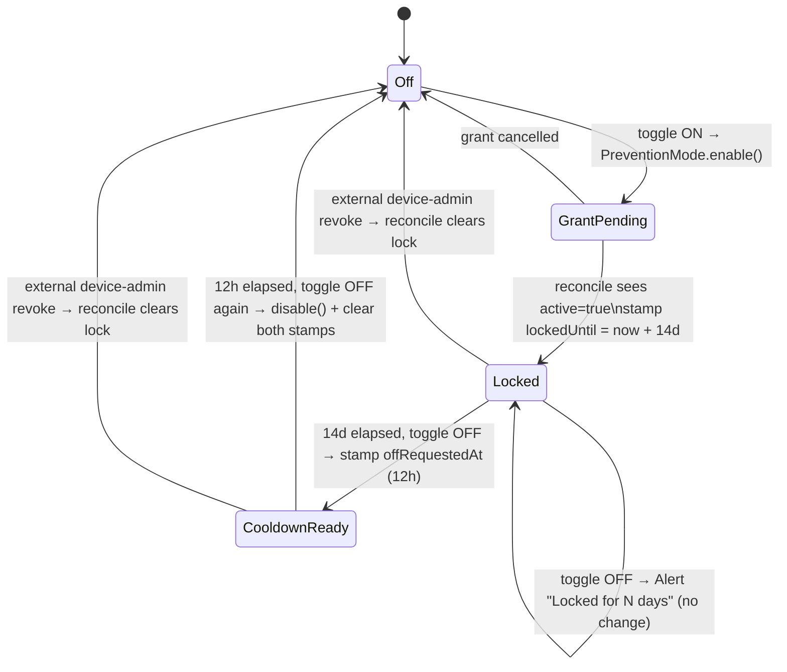

# Plan: Safe-area fixes, light-mode polish, 14-day Prevention Mode lock

## Context
Three issues in the `locked` Expo app:
1. **Overlap bug** — the bottom tab bar uses a fixed `height: 60` with no safe-area inset, so on Android gesture-nav phones the tab items collide with the system gesture pill. The 3 main tab screens also hardcode `paddingTop: 40` for the status bar, which is wrong on notched/cutout devices.
2. **Light mode** — readability issues; most concretely the `Switch` "off" track is white-on-white in light mode (`trackColor.false = Colors.bgSecondary` = `#FFFFFF`), so it disappears, and the white cards on the warm-gray bg have no border, so they read flat.
3. **Prevention Mode** is too easy to back out of. Once enabled it should not be disable-able for **14 days**; after that the existing 12-hour request→confirm step still applies.

Verified against the code: `SafeAreaProvider` already wraps the app (`App.tsx:39`), `react-native-safe-area-context@^5.8.0` is a dep, all three tab screens render `<View style={styles.header}>` (so an inline style override merges cleanly), and the storage cooldown pattern (`preventionModeOffRequestedAt` / `isPreventionDisableReady`) is the model to mirror. DNS is confirmed working — no change there.

---

## 1. Safe-area / overlap fix

**Tab bar — `src/navigation/AppNavigator.tsx`, `MainTabs` (L22-58):**
- Import `useSafeAreaInsets` from `react-native-safe-area-context`; call `const insets = useSafeAreaInsets();` inside `MainTabs` (it's already a component).
- In `tabBarStyle` (L30-37) replace the fixed bottom sizing:
  ```
  height: 60 + insets.bottom,
  paddingBottom: 8 + insets.bottom,
  ```
  Leave `paddingTop: 6` unchanged.

**Header top — 3 tab screens** (`HomeScreen.tsx`, `BlockedAppsScreen.tsx`, `ConfigurationScreen.tsx`):
- Add `useSafeAreaInsets()` in each component.
- Remove the hardcoded `paddingTop: 40` from each `makeStyles` `header` block (`HomeScreen.tsx:148`, `BlockedAppsScreen.tsx:170`, `ConfigurationScreen.tsx:326`) and apply it inline at the render site:
  `<View style={[styles.header, { paddingTop: insets.top + 12 }]}>`
  (`HomeScreen.tsx:71`, `BlockedAppsScreen.tsx:92`, `ConfigurationScreen.tsx:168`).
- Leave the modal stack screens (`AddAppsScreen`, `UnlockProgressScreen`) as-is — out of scope; `AddAppsScreen` already uses `SafeAreaView`.

No per-screen bottom padding change: tab screens render in the content area above the tab bar, so reserving the tab-bar inset fixes the collision. Existing `bottomSpacer` (24px) stays.

## 2. Light-mode polish

Palettes live in `src/colors.ts`. All bounded to the Settings tab's shared card/switch styling — no layout redesign.

- **Switch off-track invisible** — add a `switchTrackOff` key to `Palette`, `DarkColors` (`#3A3A3A`), and `LightColors` (`#C4C4BE`). Reference it in both Switches in `ConfigurationScreen.tsx` (`trackColor.false`): Light Mode switch (L192) and Prevention Mode switch (L259), replacing `Colors.bgSecondary`.
- **Card separation in light mode** — add a hairline `borderWidth: 1, borderColor: Colors.border` to the `securityRow` (L390) and `modeCard` (L344) styles in `ConfigurationScreen.tsx`. `modeCardActive` (L353) already sets `borderWidth: 2` + accent, so the active state still overrides cleanly; in dark mode `border` is ~6% white so there's no regression.

## 3. Prevention Mode 14-day lock

Mirror the existing timestamp-cooldown helpers in `src/store/storage.ts`.

**Storage — `src/store/storage.ts`:**
- Add `preventionModeLockedUntil: number | null` to `Settings` (L63-69).
- Add default `preventionModeLockedUntil: null` to both `getSettings` default branches (L163-169 and L171-177). Existing users get `null` → **not retroactively locked** (intentional; the lock is only stamped on the next enable).
- Add a constant + helpers next to the existing prevention block (after L224):
  ```ts
  export const PREVENTION_LOCK_MS = 14 * 24 * 60 * 60 * 1000; // 14 days
  export const preventionLockRemainingMs = (): number => {
    const { preventionModeLockedUntil } = getSettings();
    if (preventionModeLockedUntil == null) return 0;
    return Math.max(0, preventionModeLockedUntil - Date.now());
  };
  export const isPreventionLocked = (): boolean => preventionLockRemainingMs() > 0;
  ```

**State machine — `ConfigurationScreen.tsx`** (import the new helpers from storage):
- `reconcilePreventionMode` (L79-98) is the real source of the off→on transition (the ON toggle only launches the grant; the flip happens here on foreground). Inside the `prev.preventionMode !== active` block, set `preventionModeLockedUntil` in the `next` object:
  - off→on (`active === true`, prev was false) → `Date.now() + PREVENTION_LOCK_MS` (re-enabling after a prior lock expired starts a **fresh** 14-day lock).
  - any→off (`active === false`, e.g. external device-admin revoke) → `null`.
- `togglePreventionMode` (L116-163):
  - **ON** path unchanged (keep clearing `preventionModeOffRequestedAt`; reconcile stamps the lock).
  - **OFF** path: first check `isPreventionLocked()`. If locked → `Alert` "Locked for N more day(s)" and return (no state change; switch stays on). Only once unlocked does the **existing 12-hour request→confirm flow run unchanged**. On successful disable, also clear `preventionModeLockedUntil` alongside `preventionModeOffRequestedAt`.
- **UI** — Prevention Mode row (L256-261): when `isPreventionLocked()`, set the `Switch` `disabled` and append remaining days to the desc text (L254), e.g. `Locked for ${Math.ceil(preventionLockRemainingMs() / 86_400_000)} more day(s).`



**Known limitation (not solved, consistent with existing behavior):** the lock is a UX gate. A user can still revoke device-admin in Android system settings, which `reconcilePreventionMode` detects and clears the lock. The pre-existing 12h cooldown had the identical hole — this is consistent, not a new weakness. Not tamper-proof.

---

## Files touched
- `src/navigation/AppNavigator.tsx` — tab-bar bottom inset
- `src/screens/HomeScreen.tsx`, `src/screens/BlockedAppsScreen.tsx`, `src/screens/ConfigurationScreen.tsx` — header top inset
- `src/colors.ts` — `switchTrackOff` palette key (Palette type + both palettes)
- `src/screens/ConfigurationScreen.tsx` — switch off-track + card borders (light polish) + prevention-lock UI/logic
- `src/store/storage.ts` — `preventionModeLockedUntil` field + default, `PREVENTION_LOCK_MS`, helpers

## Verification
1. `npx tsc --noEmit` — type-checks the new `Settings` field, palette key, and helpers (`switchTrackOff` must be added to the `Palette` type or both palette literals will error).
2. Build + install: `npm run build:android` then `npm run install:android` (produces `locked.apk`).
3. **Overlap**: on a gesture-nav Android device, tab icons/labels clear the gesture pill; header title clears the status bar on a notched device. Toggle light mode — same.
4. **Light mode**: both switches show a visible off-track; `securityRow` / `modeCard` cards are delineated against the bg.
5. **Prevention lock**:
   - Enable Prevention Mode → grant device-admin → switch becomes disabled, desc shows "Locked for 14 more days."
   - Try to disable → blocked with the locked alert.
   - (Dev) temporarily set `PREVENTION_LOCK_MS` to ~1 min: after expiry, toggling off triggers the 12h request alert; a second toggle after 12h disables.
   - Disable, then re-enable → a fresh 14-day lock is stamped.
